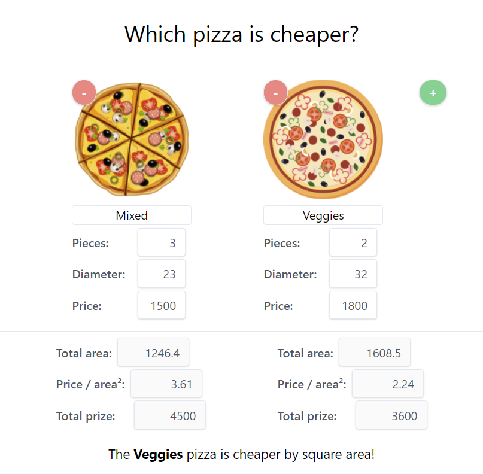

# Pizza calculator

This app answers the question to the age-old problem:
Which pizza is more cost-effective (better value);
2 pieces with a smaller diameter, or 1 bigger piece?

You provide the following values:

- pizza size in diameter
- how many pieces
- price of the whole pizza

and it will answer the question:

